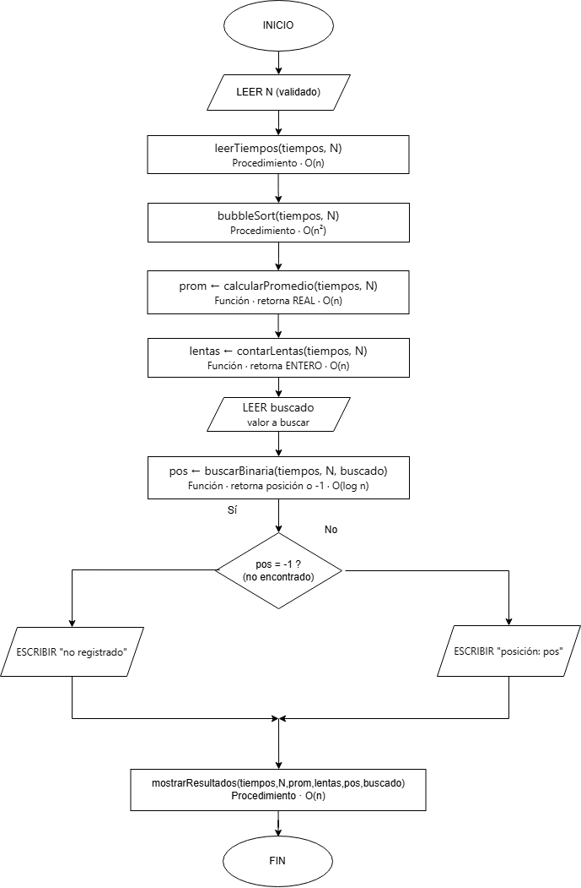

# Evaluación Semana 3 - Algoritmos

## Descripción del sistema
El sistema supervisa el rendimiento de una API mediante el registro, ordenamiento y análisis de los tiempos de respuesta de las solicitudes realizadas por los usuarios. Está compuesto por seis módulos coordinados por un algoritmo principal. El procedimiento **leerTiempos** captura los tiempos de respuesta y valida que cada valor sea mayor que cero antes de almacenarlo en un arreglo. El procedimiento **bubbleSort** ordena los tiempos de menor a mayor utilizando el algoritmo de burbuja con una bandera de optimización. La función **calcularPromedio** obtiene el tiempo promedio de respuesta, mientras que la función **contarLentas** determina cuántas respuestas superan los 200 milisegundos. La función **buscarBinaria** localiza un tiempo específico dentro del arreglo ordenado y devuelve su posición o **-1** si no existe. Finalmente, el procedimiento **mostrarResultados** presenta el arreglo ordenado, el promedio, la cantidad de respuestas lentas y el resultado de la búsqueda. **Entrada:** el número de tiempos de respuesta y sus valores. **Salida:** el arreglo ordenado, el promedio, la cantidad de respuestas lentas y el resultado de la búsqueda.

---

## Pseudocódigo

```text
PROCEDIMIENTO leerTiempos(tiempos: ARREGLO, n: ENTERO)
VARIABLES
    i      : ENTERO
    tiempo : REAL
INICIO
    PARA i DE 1 HASTA n CON PASO 1 HACER
        ESCRIBIR "Ingrese el tiempo de respuesta ", i, " (ms): "
        LEER tiempo
        MIENTRAS tiempo <= 0 HACER
            ESCRIBIR "Valor inválido. Debe ser mayor que 0."
            LEER tiempo
        FIN_MIENTRAS
        tiempos[i] ← tiempo
    FIN_PARA
FIN_PROCEDIMIENTO

PROCEDIMIENTO bubbleSort(tiempos: ARREGLO, n: ENTERO)
VARIABLES
    i               : ENTERO
    j               : ENTERO
    temp            : REAL
    huboIntercambio : LOGICO
INICIO
    PARA i DE 1 HASTA n - 1 CON PASO 1 HACER
        huboIntercambio ← FALSO
        PARA j DE 1 HASTA n - i CON PASO 1 HACER
            SI tiempos[j] > tiempos[j + 1] ENTONCES
                temp ← tiempos[j]
                tiempos[j] ← tiempos[j + 1]
                tiempos[j + 1] ← temp
                huboIntercambio ← VERDADERO
            FIN_SI
        FIN_PARA
        SI huboIntercambio = FALSO ENTONCES
            ROMPER
        FIN_SI
    FIN_PARA
FIN_PROCEDIMIENTO

FUNCIÓN calcularPromedio(tiempos: ARREGLO, n: ENTERO): REAL
VARIABLES
    suma : REAL
    i    : ENTERO
INICIO
    suma ← 0
    PARA i DE 1 HASTA n CON PASO 1 HACER
        suma ← suma + tiempos[i]
    FIN_PARA
    RETORNAR suma / n
FIN_FUNCIÓN

FUNCIÓN contarLentas(tiempos: ARREGLO, n: ENTERO): ENTERO
VARIABLES
    i      : ENTERO
    lentas : ENTERO
INICIO
    lentas ← 0
    PARA i DE 1 HASTA n CON PASO 1 HACER
        SI tiempos[i] > 200 ENTONCES
            lentas ← lentas + 1
        FIN_SI
    FIN_PARA
    RETORNAR lentas
FIN_FUNCIÓN

FUNCIÓN buscarBinaria(tiempos: ARREGLO, n: ENTERO, buscado: REAL): ENTERO
VARIABLES
    izq   : ENTERO
    der   : ENTERO
    medio : ENTERO
INICIO
    izq ← 1
    der ← n
    MIENTRAS izq <= der HACER
        medio ← (izq + der) / 2
        SI tiempos[medio] = buscado ENTONCES
            RETORNAR medio
        SINO SI tiempos[medio] < buscado ENTONCES
            izq ← medio + 1
        SINO
            der ← medio - 1
        FIN_SI
    FIN_MIENTRAS
    RETORNAR -1
FIN_FUNCIÓN

PROCEDIMIENTO mostrarResultados(tiempos: ARREGLO, n: ENTERO, prom: REAL, lentas: ENTERO, pos: ENTERO, buscado: REAL)
VARIABLES
    i : ENTERO
INICIO
    ESCRIBIR "=== Reporte de tiempos de respuesta ==="
    ESCRIBIR "Tiempos ordenados: "
    PARA i DE 1 HASTA n CON PASO 1 HACER
        ESCRIBIR tiempos[i]
    FIN_PARA
    ESCRIBIR "Tiempo promedio: ", prom, " ms"
    ESCRIBIR "Respuestas lentas (>200 ms): ", lentas
    SI pos > -1 ENTONCES
        ESCRIBIR "Tiempo ", buscado, " encontrado en posición ", pos
    SINO
        ESCRIBIR "Tiempo ", buscado, " no registrado en el sistema."
    FIN_SI
FIN_PROCEDIMIENTO

ALGORITMO SistemaTiemposRespuestaAPI
VARIABLES
    N       : ENTERO
    tiempos : ARREGLO[30] DE REAL
    prom    : REAL
    lentas  : ENTERO
    buscado : REAL
    pos     : ENTERO

INICIO
    ESCRIBIR "¿Cuántos tiempos desea ingresar? (Máximo 30): "
    LEER N
    MIENTRAS N < 1 OR N > 30 HACER
        ESCRIBIR "Cantidad inválida. Debe estar entre 1 y 30."
        LEER N
    FIN_MIENTRAS

    leerTiempos(tiempos, N)
    bubbleSort(tiempos, N)
    prom ← calcularPromedio(tiempos, N)
    lentas ← contarLentas(tiempos, N)

    ESCRIBIR "¿Qué tiempo desea buscar (ms)? "
    LEER buscado
    pos ← buscarBinaria(tiempos, N, buscado)

    mostrarResultados(tiempos, N, prom, lentas, pos, buscado)
FIN
```

---

## Análisis de complejidad

| Módulo | Tipo | Complejidad | Justificación |
|---|---|---|---|
| leerTiempos | Procedimiento | O(n) | Recorre el arreglo una vez con un ciclo PARA. La validación MIENTRAS es constante por dato. |
| bubbleSort | Procedimiento | O(n²) | Dos ciclos anidados: pasada externa de n-1 × comparaciones internas hasta n-i. |
| calcularPromedio | Función | O(n) | Recorre una vez el arreglo para acumular la suma. |
| contarLentas | Función | O(n) | Recorre una vez el arreglo comparando cada valor contra 200. |
| buscarBinaria | Función | O(log n) | Reduce el espacio de búsqueda a la mitad en cada iteración. |
| mostrarResultados | Procedimiento | O(n) | Recorre el arreglo para mostrar los datos ordenados. |
| **Sistema completo** | Algoritmo principal | **O(n²)** | La complejidad global está dominada por `bubbleSort`. |

---

## Tabla de pruebas

| Caso | Entradas | Resultado esperado | ¿Coincide? |
|---|---|---|---|
| **Normal** | N=5 · (150,300,180,250,120) · Buscar=180 | Ordenado=(120,150,180,250,300), promedio=200, lentas=2, posición=3 | ✔ |
| **Límite** | N=1 · (200) · Buscar=200 | Ordenado=(200), promedio=200, lentas=0, posición=1 | ✔ |
| **Error** | N=3 · (100,150,190) · Buscar=500 | Ordenado=(100,150,190), promedio=146.67, lentas=0, posición=-1, mensaje="500 no registrado" | ✔ |

---

## Diagrama de flujo

